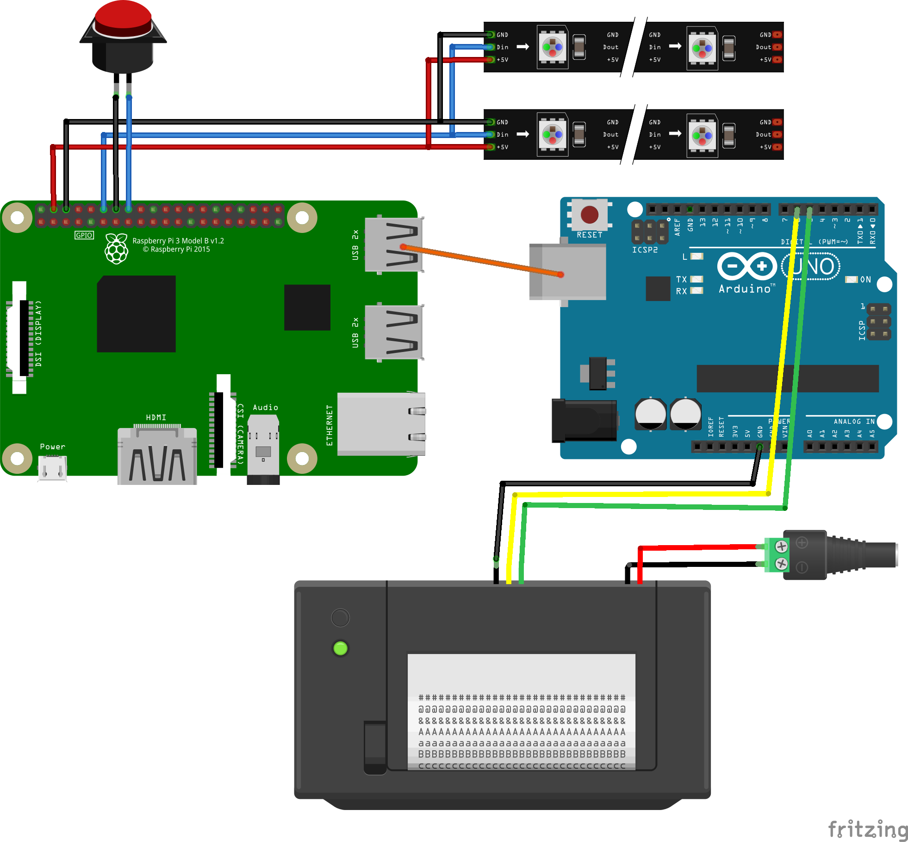

# photobooth
RaspberryPi Photobooth software written in Python using [Adafruit Neopixels](https://www.adafruit.com/category/168) and a [Raspberry Pi Camera](https://www.raspberrypi.org/help/camera-module-setup/).

# What is this?
This is a software and hardware implementation for a photobooth, where people can create stop motion gifs. For this people can sit infront of a camera and start the capture process by pressing a hardware button. Then the software takes an predefined amount of pictures and generates a gif. This gif is then played and can be uploaded to an online service. To guide the user, there are also visualizations using a display and Neopixel LEDs.

# What do you need?
First of all you need a **Raspberry Pi**. I would recommend a **RPi 3 Rev. B**, since the older version are slower and the gif generations takes longer. Therefore the user experience might is worse. Also you need the mandatory hardware for the Raspberry Pi: an **microUSB power adapter with 5V and atleast 2A** & a **microSD card with atleast 16GB** memory. Also a mouse and keyboard for debugging. And a LAN cable if you dont use Wifi.

Next you need some other Hardware: 
* a **display with HDMI** and an HDMI cable connected to the RPi
* a **[Raspberry Pi camera](https://www.raspberrypi.org/help/camera-module-setup/)**
* some **hardware buttons and cables**
* a **[Neopixel ring with 16 pixels or more](https://www.adafruit.com/product/1463)**

# Hardware setup

Connect the hardware from above to the Raspberry Pi. Plug in the display and the input devices. Connect the camera to the port on the RPi. Connect the button and Neopixels according to the Fritzing layout below.

# Installation

Get your Raspberry Pi working with Raspbian following [the official tutorials](https://www.raspberrypi.org/help/quick-start-guide/).

Install the neopixel library from [Adafruit and jgarff](https://github.com/jgarff/rpi_ws281x). There are more [informations and examples here](https://learn.adafruit.com/neopixels-on-raspberry-pi/software).

Install viewnior using `sudo apt-get install viewnior`

Start by calling the camera.py as root: `sudo python camera.py`

# Prevent Display Blanking

By default, the display will be turned off after a few moments. You wont notice this when the preview is open, because it overlays the blank screen somehow. But the replay of the gif wont work. So we need to address and fix that. I found two possible solutions which work on different devices. Try one or both of them. [Check the solutions from Foggy and Rasadmin here.](https://www.raspberrypi.org/forums/viewtopic.php?f=66&t=18200)

First solution (by Foggy):

1. Open the kbd config file: `sudo nano /etc/kbd/config`
2. Change `BLANK_TIME` and `POWERDOWN_TIME` to `0` (zero)
3. Restart the file using `sudo /etc/init.d/kbd restart` or reboot your RPi

Second solution (by Rasadmin):

1. Open the lightdm config file: `sudo nano /etc/lightdm/lightdm.conf`
2. Find the header `[SeatDefault]` and insert `xserver-command=X -s 0 dpms` below that header
3. Reboot your RPi
